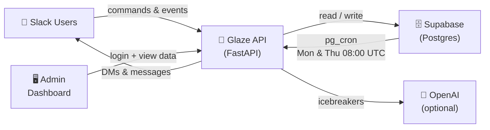

# Glaze

Glaze is a lightweight Slack app that creates recurring 1-on-1 coffee chat matches, similar to Donut, with a low-cost Python stack.

## Features

- Auto-enroll members of a configured Slack channel
- Opt out / opt in with slash commands
- Weekly / bi-weekly / monthly frequency per user
- 1-4 week snooze
- No-repeat matching logic
- Optional cross-department prioritization using Slack profile fields
- Automatic group DM creation for each pair
- AI-generated icebreakers
- Thursday nudge when a pair has not started talking yet
- No message content stored in the database

## Stack

- Python 3.11+
- FastAPI
- Slack Bolt for Python
- Supabase (Postgres)
- OpenAI optional for icebreakers
- Deployable to AWS Lambda via Mangum, or any ASGI host

## Project layout

- `app.py` - ASGI entry point
- `glaze/settings.py` - environment loading
- `glaze/slack_app.py` - Slack Bolt app wiring
- `glaze/routes/handlers.py` - commands, events, and actions
- `glaze/services/matching.py` - pairing algorithm
- `glaze/services/icebreakers.py` - AI and fallback icebreakers
- `glaze/services/scheduler.py` - cycle runner and nudge runner
- `glaze/db/repository.py` - database access
- `supabase/schema.sql` - database schema
- `manifest/slack_manifest.yaml` - Slack app manifest

## Architecture



## Environment variables

Copy `.env.example` to `.env`.

Required:

- `SLACK_BOT_TOKEN`
- `SLACK_SIGNING_SECRET`
- `SLACK_APP_TOKEN` (only needed if you later use Socket Mode; not used by default here)
- `GLAZE_DEFAULT_CHANNEL_ID`
- `SUPABASE_URL`
- `SUPABASE_SERVICE_ROLE_KEY`
- `OPENAI_API_KEY` (optional)

Optional:

- `APP_BASE_URL` - public base URL for Slack requests
- `GLAZE_DEFAULT_FREQUENCY` - default `biweekly`
- `GLAZE_MATCH_HOUR_UTC` - default `17` for Monday 10am PT in standard time; better to use platform scheduler in your local TZ
- `GLAZE_CROSS_DEPARTMENT_WEIGHT` - default `20`
- `GLAZE_REPEAT_PENALTY_DAYS` - default `3650`

## Local development

```bash
python -m venv .venv
source .venv/bin/activate
pip install -r requirements.txt
cp .env.example .env
uvicorn app:app --reload --port 3000
```

Expose your local app to Slack using ngrok or Cloudflare Tunnel and set Slack request URLs to:

- Events: `https://YOUR-URL/slack/events`
- Slash commands: `https://YOUR-URL/slack/commands`
- Interactivity: `https://YOUR-URL/slack/interactivity`

## Setup steps

1. Create a Slack app and paste `manifest/slack_manifest.yaml` into the manifest editor.
2. Install the app to your workspace.
3. Create the Supabase tables using `supabase/schema.sql`.
4. Fill out `.env`.
5. Invite the app to the target channel.
6. Open the app home once so Slack can initialize Home tab access.

## Slash commands

- `/glaze-on` - opt back in
- `/glaze-off` - opt out
- `/glaze-frequency weekly|biweekly|monthly`
- `/glaze-snooze 1|2|3|4`
- `/glaze-home` - refreshes the Home tab
- `/glaze-run-now` - admin command to trigger a cycle manually

## Scheduling

This app separates interactive Slack requests from recurring jobs.

Recommended schedulers:

- AWS EventBridge calling `/tasks/run-cycle`
- AWS EventBridge calling `/tasks/run-nudges`
- Vercel Cron or Supabase Edge Functions can also hit these endpoints

Example schedule:

- Monday 08:00 AM UTC: `/tasks/run-cycle`
- Thursday 08:00 AM UTC: `/tasks/run-nudges`

Protect those endpoints using `X-Admin-Token: $ADMIN_TRIGGER_TOKEN`.

### Supabase pg_cron (simplest option)

Supabase projects ship with `pg_cron` and `pg_net` enabled. Run the schedule block at the bottom of `supabase/schema.sql` once in the **Supabase SQL Editor** — no CLI or extra deploy needed.

Replace the placeholder values first:

```sql
-- Monday 08:00 UTC
select cron.schedule(
  'glaze-run-cycle',
  '0 8 * * 1',
  $$
    select net.http_post(
      url     := 'https://your-app.com/tasks/run-cycle',
      headers := '{"x-admin-token": "your-admin-trigger-token"}'::jsonb
    );
  $$
);

-- Thursday 08:00 UTC
select cron.schedule(
  'glaze-run-nudges',
  '0 8 * * 4',
  $$
    select net.http_post(
      url     := 'https://your-app.com/tasks/run-nudges',
      headers := '{"x-admin-token": "your-admin-trigger-token"}'::jsonb
    );
  $$
);
```

Inspect jobs and run history:

```sql
select * from cron.job;
select * from cron.job_run_details order by start_time desc limit 20;
```

Remove a job:

```sql
select cron.unschedule('glaze-run-cycle');
```

## Rotating keys

### Slack

1. Rotate the bot token in Slack app settings.
2. Update `SLACK_BOT_TOKEN` in your secret store.
3. Re-deploy.

### Supabase

1. Rotate the service role key in Supabase.
2. Update `SUPABASE_SERVICE_ROLE_KEY`.
3. Re-deploy.

### OpenAI

1. Rotate `OPENAI_API_KEY`.
2. Re-deploy.

## Privacy

Glaze stores only:

- Slack user id
- participation state
- frequency
- snooze-until date
- pair history and timestamps
- dm channel id and intro timestamp

Glaze does **not** persist Slack message bodies.

For Thursday nudges, the app reads recent conversation history from Slack, checks whether any human message exists, and discards the content immediately.

## Deployment notes

### AWS Lambda

Use `Mangum` with API Gateway or Lambda Function URLs.

Handler:

```python
from app import handler
```

### Vercel / any ASGI host

Deploy as a Python ASGI app and expose the same endpoints.

## Success checklist

- [ ] App installs from manifest
- [ ] Slash commands work
- [ ] Home tab shows preferences
- [ ] Match cycle creates DMs for active users
- [ ] Frequency changes affect next cycle
- [ ] Thursday nudges send only for silent pairs

## Tradeoffs / notes

- If your workspace has an odd number of participants, one person will be left unmatched for the cycle. The current implementation rotates leftovers fairly over time.
- Department matching is best-effort because Slack profile field names differ by workspace.
- AI icebreakers fall back to a curated local list if OpenAI is unavailable.
